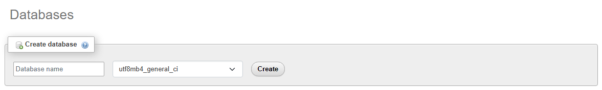
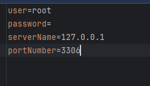
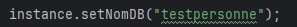
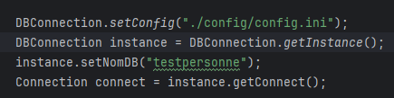

# 📘 Documentation du Projet

**Développé par :** BOUAOUKEL Walid

Ce document explique comment configurer l'environnement pour exécuter l'application correctement.

---

## ⚠️ Configuration Requise

Pour que l'application puisse se connecter à la base de données (BD), il est nécessaire de suivre ces deux étapes principales.

### 1. Création de la Base de Données
Vous devez d'abord créer la base de données dans votre système de gestion (SGBD).

> **Important :** Souvenez-vous du **nom exact** de la base de données que vous choisissez, car il sera utilisé dans la classe `Main`.

*Exemple de création de la base de données*

---

### 2. Configuration du Fichier `config.ini`
Insérez les informations de votre système de gestion de BD dans le fichier situé dans `config > config.ini`. Ces informations serviront à l'application pour s'authentifier et accéder aux données.

Voici les paramètres à configurer (utilisateur, mot de passe, IP, port) :

*Exemple de configuration dans le fichier ini*

---

## 🚀 Utilisation dans le Code

Une fois la configuration terminée, assurez-vous que le code pointe vers la bonne base de données.

Dans le `Main`, le nom de la base de données est défini comme ceci :

L'initialisation de la connexion utilise ensuite ce fichier de configuration pour établir le lien :

